# MCP Filesystem Assistant

A robust Model Context Protocol (MCP) client-server implementation that enables AI models to safely interact with the filesystem through controlled, validated tools.

[](https://github.com/yourusername/mcp/actions/workflows/tests.yml)

## Architecture

### Architecture Diagram



### Server (`server.py`)

- **FastMCP-based tool server** exposing filesystem operations
- **Path sandboxing**: all operations restricted to `MCP_ALLOWED_ROOT`
- **Structured error handling**: unified response format with error codes
- **Robust validations**: file size limits, existence checks, permission checks
- **Atomic operations**: safe file creation, timestamped backups, multi-mode writes

### Client (`client.py`)

- **MCP stdio transport**: connects to server via async stdio client
- **Ollama LLM integration**: uses local LLM for reasoning and tool selection
- **Multi-step tool loop**: supports up to `MAX_TOOL_STEPS` tool calls per user query
- **Argument normalization**: converts string booleans ("true"/"false") to Python booleans
- **Smart validation**: schema validation before tool execution with detailed error messages
- **Timeout protection**: 30-second timeout guard on tool execution
- **Audit logging**: comprehensive logs of user input, model output, and tool calls
- **Enhanced system prompt**: includes important rules, examples, and tool schemas

## Project Structure

```text
mcp/
├── client.py              # MCP client with Ollama integration
├── server.py              # FastMCP server with filesystem tools
├── calculator.py          # Calculator utility functions
├── demo.py                # Demo script
├── requirements.txt       # Python dependencies
├── .env.example           # Environment configuration template
├── README.md              # This file
├── logs/                  # Audit logs directory
├── tests/                 # Test suite
│   └── test_server.py
└── tools/                 # Utility tools
    ├── analyse.py
    └── read_file.py
```

## Requirements

- Python 3.10+
- Ollama installed and running locally
- Ollama model available (default: `qwen2.5-coder:7b`)

Install dependencies:

```bash
pip install -r requirements.txt
```

Pull Ollama model if needed:

```bash
ollama pull qwen2.5-coder:7b
```

## Configuration

Copy `.env.example` to `.env` and customize as needed.

### Environment Variables

| Variable             | Default            | Description                             |
| -------------------- | ------------------ | --------------------------------------- |
| `OLLAMA_MODEL`       | `qwen2.5-coder:7b` | LLM model for client reasoning          |
| `MAX_TOOL_STEPS`     | `6`                | Maximum tool-call iterations per prompt |
| `MCP_SERVER_SCRIPT`  | `./server.py`      | Path to MCP server entry point          |
| `AUDIT_LOG_PATH`     | `./logs/audit.log` | Path for audit logging                  |
| `MCP_ALLOWED_ROOT`   | Current directory  | Safe root path for file operations      |
| `MCP_FILE_ENCODING`  | `utf-8`            | Default text encoding                   |
| `MCP_MAX_READ_BYTES` | `2000000`          | Maximum file read size (2 MB)           |
| `MCP_TRANSPORT`      | `stdio`            | MCP transport type                      |

## Usage

Start the interactive MCP assistant:

```bash
python client.py
```

Type `exit` to quit the session.

The client automatically spawns and connects to the server via stdio.

### Example Interactions

```
You: Create a Python file called hello.py with a simple hello world function
Assistant: I'll create a hello.py file with a simple hello world function...
[tool calls to create_file and write_file]

You: Read the file and analyze it
Assistant: [reads and analyzes the file]

You: exit
```

## Server Tools

### File Reading

**`read_file(path: str)`**

- Reads UTF-8 text files under the allowed root
- Returns file content with encoding information
- Respects `MCP_MAX_READ_BYTES` limit

**`list_files(path: str = ".")`**

- Lists files and directories with metadata
- Distinguishes between regular files, directories, and symlinks
- Returns sorted entries by name

### File Analysis

**`analyze_python_file(path: str)`**

- Parses Python source code and extracts metrics
- Returns: line count, character count, function count, class count
- Provides code quality insights

**`search_word(path: str, word: str)`**

- Case-insensitive word search within a file
- Returns matching line numbers and line content
- Useful for finding specific patterns

### File Writing

**`create_file(path: str, overwrite: bool = False)`**

- Atomic file creation (uses `open("x")` mode)
- Protected by default against accidental overwrites
- Set `overwrite=true` to replace existing files

**`write_file(path: str, content: str, mode: str = "overwrite", confirm_overwrite: bool = False, create_backup: bool = False)`**

- Write text with safety guards:
  - `mode`: `"overwrite"` (default) or `"append"`
  - `confirm_overwrite`: Required to modify existing files
  - `create_backup`: Creates timestamped `.bak` files before overwriting
- Prevents accidental data loss

## Response Format

All tools return a structured JSON response:

```json
{
  "success": true,
  "data": {
    "path": "/path/to/file",
    "content": "...",
    "encoding": "utf-8"
  },
  "error": null
}
```

Error responses:

```json
{
  "success": false,
  "data": null,
  "error": {
    "code": "permission_denied",
    "message": "Path is outside allowed root"
  }
}
```

### Error Codes

- `permission_denied`: Path outside allowed root
- `not_found`: File or directory doesn't exist
- `already_exists`: File exists and overwrite not confirmed
- `is_directory`: Operation expects file, got directory
- `encoding_error`: Text encoding issues
- `syntax_error`: Invalid Python syntax
- `timeout`: Tool execution exceeded timeout
- `unknown_tool`: Tool name not recognized

## Key Features

✅ **Safe sandbox**: Path resolution prevents directory traversal attacks  
✅ **Data protection**: Overwrite confirmation and timestamped backups  
✅ **Error resilience**: Comprehensive error handling with descriptive messages  
✅ **LLM-friendly**: Schema validation ensures LLM tool calls are valid  
✅ **Multi-step reasoning**: LLM can chain multiple tool calls per query  
✅ **Audit trail**: All interactions logged for debugging and transparency  
✅ **Type normalization**: Auto-converts string booleans to correct types  
✅ **Timeout guards**: Prevents hanging on long-running operations

````

or

```json
{
  "success": false,
  "data": null,
  "error": {
    "code": "invalid_input",
    "message": "..."
  }
}
````

## Safety Model

- Rejects paths outside `MCP_ALLOWED_ROOT`.
- Requires explicit overwrite confirmation for existing files.
- Supports optional backup creation before writes.
- Limits large reads using `MCP_MAX_READ_BYTES`.

## Testing

Run unit tests:

```bash
python -m unittest discover -s tests -p "test_*.py" -v
```

Tests cover:

- create/read/write flow
- overwrite confirmation behavior
- path escape blocking
- word search matches
- Python file analysis

## Troubleshooting

1. `ModuleNotFoundError`
   - Install dependencies from `requirements.txt`.

2. Ollama connection/model errors
   - Ensure Ollama is running.
   - Verify `OLLAMA_MODEL` exists locally.

3. File access denied
   - Check `MCP_ALLOWED_ROOT` and ensure requested path is inside it.
